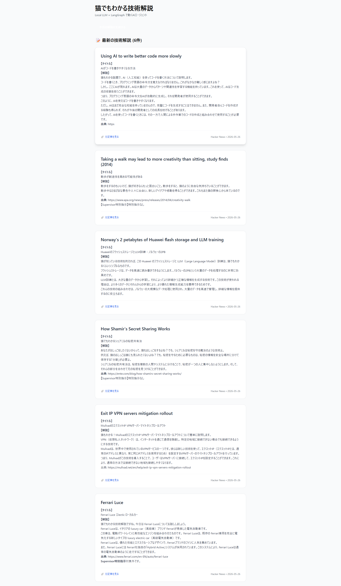

# 猫でもわかる技術解説エージェント

Local LLM + LangGraph で動作するパーソナライズドTech Curator AIエージェントです。

WSL2 + Ubuntu環境で、16GBメモリでも動作する軽量設計にしています。

## 特徴

- 本物のAI Agentアーキテクチャ: LangGraphによるstateful workflow + Reflectionループ + Supervisor Agent
- 著作権に配慮した設計: RSS/APIからメタデータのみ取得し、LLMで「猫でもわかる」解説を生成
- フィードバック学習: いいね・評価に基づくおすすめ機能（準備中）
- ローカル完結: すべてローカルLLM（GGUF）で動作
- Web UI: FastAPI + HTMX + Tailwind

## 画面イメージ


## 技術スタック（トレンド重視）

- LLM Runtime: llama.cpp (GGUF)
- Agent Framework: LangGraph (LangChainエコシステム)
- Inference: Llama-3.2-3B / Qwen2.5-7B など
- Backend: FastAPI
- Frontend: HTMX + Tailwind CSS
- Database: SQLite + LanceDB (Vector)
- その他: Pydantic, APScheduler（予定）

## 用語解説（初心者向け）

- Local LLM: ローカルPC上で動く大規模言語モデル
- LangGraph: LangChainの拡張機能。複雑な「複数のAIが協力するワークフロー」をグラフとして定義・制御できる強力なライブラリ
- Reflection Loop: AIが自分で生成した回答を「猫の視点で批評」し、必要なら修正する仕組み。品質を自動的に高める手法
- Supervisor Agent: 複数の専門エージェント（解説担当、批評担当など）を「誰を次に動かすか」決める監督者役


## セットアップ

```bash
# 1. リポジトリクローン
git clone https://github.com/yutnagase/neko-tech-curator-agent.git
cd neko-tech-curator-agent

# 2. Python環境
pyenv install 3.12.4
pyenv local 3.12.4
python -m venv .venv
source .venv/bin/activate

# 3. 依存関係インストール
pip install -r requirements.txt

# 4. モデル配置（modelsフォルダにGGUFモデルを置く）
mkdir -p models data

# 5. ".env"ファイルを作成
cp .env.example .env

# 5.1. 自分の環境に合わせてモデルパスを修正
# nano .env

# 6. 初回実行（解説生成）
python daily_run.py

# 7. Webサーバー起動
python main.py