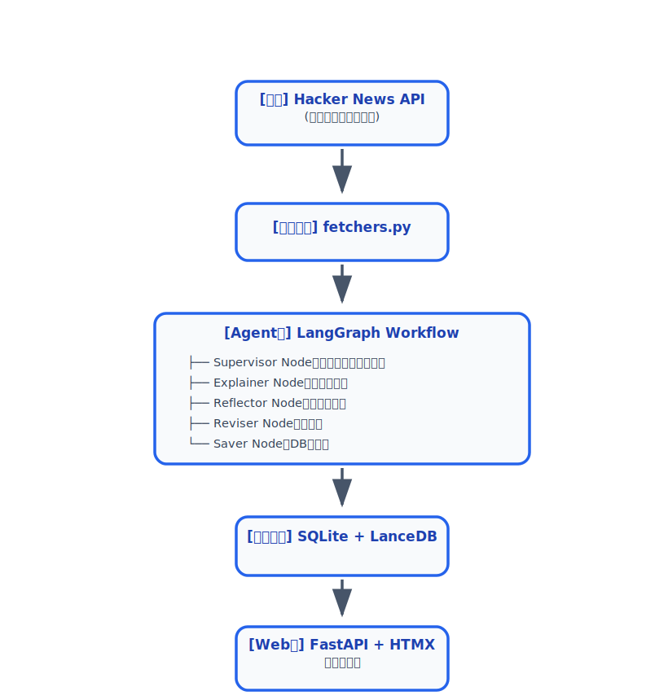

# システムアーキテクチャ概要

## 全体像

このプロジェクトは 3つの独立した実行形態 を持ちます。

1. Webアプリケーション（`main.py`）
2. 日次バッチ処理（`daily_run.py`）
3. 共通コア（`src/`）

### 高レベルレイヤー図

## 設計思想

- Single Responsibility: 各ノードは1つの役割に特化
- Stateful Workflow: LangGraphの`AgentState`で全処理の状態を一元管理
- Reflectionによる品質向上: 1回生成して終わりではなく、「猫が理解できるか？」を自己評価して改善
- Local First & Privacy: 一切のユーザー行動を外部に送信しない
