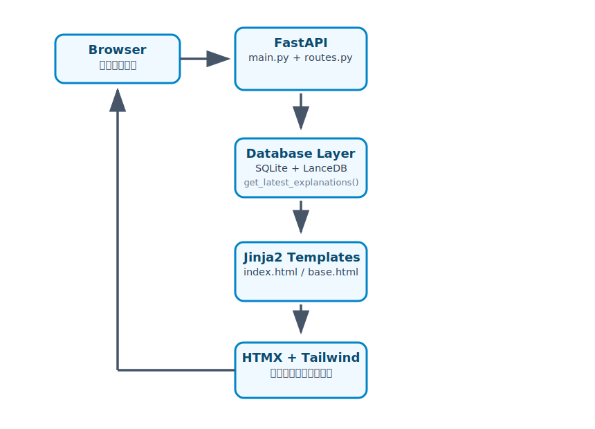

# Web Backend (FastAPI)

## 役割
ユーザーからの閲覧リクエストを受け、DBからデータを取得してHTMLを生成・返却します。

## アーキテクチャフロー

## 主要ファイル構成

- `main.py`  
  FastAPIアプリケーションのエントリポイント。  
  アプリの初期化、静的ファイルマウント、テンプレート設定、ルーター登録を行います。

- `src/api/routes.py`  
  実際のエンドポイント定義ファイル。  
  現在は主にトップページ（`/`）のみ実装。
  エンドポイントで `get_latest_explanations()` で最新20件を取得し、`index.html` に渡します。

- `src/core/database.py`  
  データ取得ロジック（`get_latest_explanations()` など）。

## 処理フロー詳細

1. Browser → HTTP GETリクエスト（例: `/`）
2. FastAPI Routes がリクエストを受け取り
3. Database Layer から最新の解説データを取得
4. Jinja2 でHTMLテンプレートにデータを埋め込み
5. HTMX + Tailwind で装飾されたHTMLをレスポンス
6. ブラウザで表示（部分更新も可能）

## 設計思想

- 軽量さを重視: React/Vueなどの重いフロントエンドフレームワークを避け、HTMX で十分な動的UIを実現
- サーバーサイドレンダリング中心: SEO対策と初期表示速度を優先
- 将来的拡張性: 
  - いいね機能（POSTエンドポイント）
  - 検索API
  - おすすめ機能（Recommender Agent連携）

